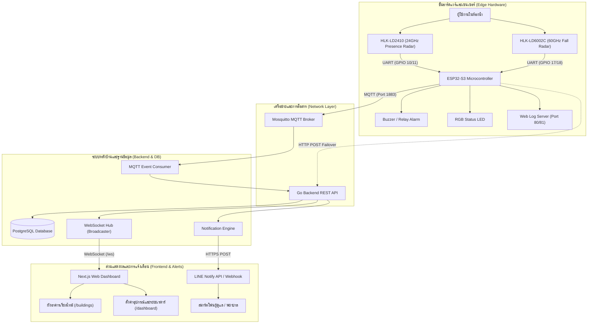
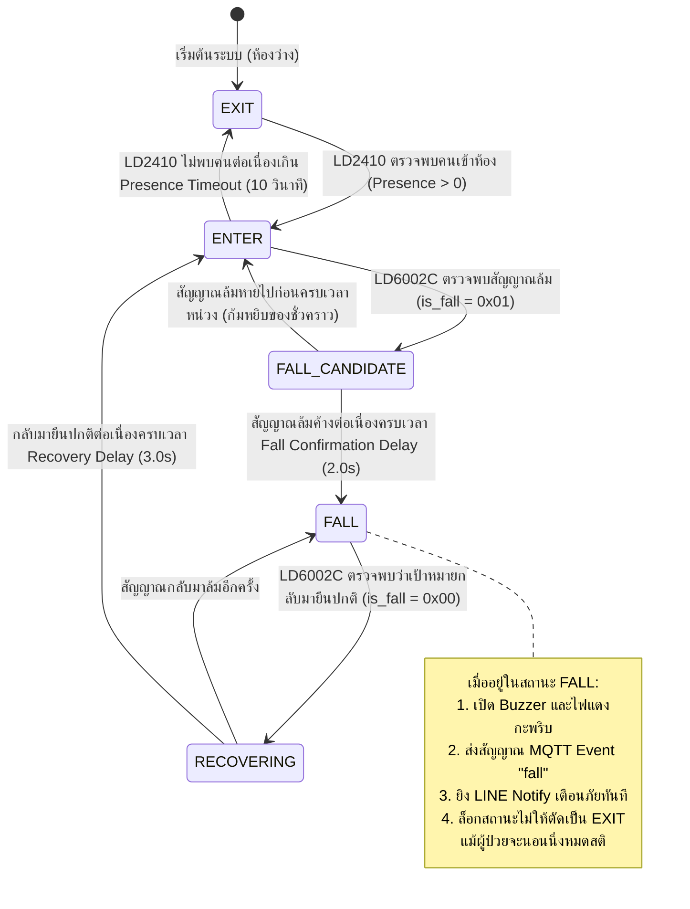

# 🚨 ระบบตรวจจับการล้มอัจฉริยะในห้องน้ำด้วยเรดาร์คลื่นมิลลิเมตร 60 GHz
## Smart Fall Detection System using 60 GHz mmWave Radar & ESP32-S3

[](https://golang.org/)
[](https://nextjs.org/)
[](https://react.js.org/)
[](https://www.espressif.com/)
[](https://www.postgresql.org/)
[](https://www.docker.com/)
[](https://azure.microsoft.com/)

> **โปรเจกต์ปริญญานิพนธ์ / Final Project**: ระบบตรวจจับและแจ้งเตือนอุบัติเหตุการล้มในห้องน้ำแบบเรียลไทม์ โดยใช้เทคโนโลยีเรดาร์คลื่นมิลลิเมตร (mmWave Radar) ร่วมกับบอร์ดไมโครคอนโทรลเลอร์ ESP32-S3 ทำงานร่วมกับระบบคลาวด์และเว็บแอปพลิเคชัน ไม่ใช้กล้องวงจรปิดเพื่อรักษาความเป็นส่วนตัวสูงสุด (100% Privacy-Preserving)

---

## 📑 สารบัญ (Table of Contents)
1. [บทนำและภาพรวมโครงการ (Project Overview)](#-1-บทนำและภาพรวมโครงการ-project-overview)
2. [จุดเด่นและฟีเจอร์สำคัญ (Key Features)](#-2-จุดเด่นและฟีเจอร์สำคัญ-key-features)
3. [สถาปัตยกรรมระบบโดยรวม (System Architecture)](#-3-สถาปัตยกรรมระบบโดยรวม-system-architecture)
4. [ตรรกะการตรวจจับและการประมวลผล (Detection Logic & State Machine)](#-4-ตรรกะการตรวจจับและการประมวลผล-detection-logic--state-machine)
5. [รายละเอียดฝั่งฮาร์ดแวร์และเฟิร์มแวร์ (Hardware & Firmware)](#-5-รายละเอียดฝั่งฮาร์ดแวร์และเฟิร์มแวร์-hardware--firmware)
6. [รายละเอียดฝั่งระบบหลังบ้าน (Backend - Go / Gin)](#-6-รายละเอียดฝั่งระบบหลังบ้าน-backend---go--gin)
7. [รายละเอียดฝั่งระบบหน้าบ้าน (Frontend - Next.js / React)](#-7-รายละเอียดฝั่งระบบหน้าบ้าน-frontend---nextjs--react)
8. [สถาปัตยกรรมและการติดตั้งบนคลาวด์ Azure (Cloud & DevOps)](#-8-สถาปัตยกรรมและการติดตั้งบนคลาวด์-azure-cloud--devops)
9. [คู่มือการติดตั้งและเริ่มต้นใช้งาน (Quick Start Guide)](#-9-คู่มือการติดตั้งและเริ่มต้นใช้งาน-quick-start-guide)
10. [ข้อกำหนด API และโปรโตคอลสื่อสาร (API & Protocols Reference)](#-10-ข้อกำหนด-api-และโปรโตคอลสื่อสาร-api--protocols-reference)
11. [โครงสร้างไดเรกทอรีของโครงการ (Directory Structure)](#-11-โครงสร้างไดเรกทอรีของโครงการ-directory-structure)

---

## 📌 1. บทนำและภาพรวมโครงการ (Project Overview)

### 1.1 ที่มาและความสำคัญ
อุบัติเหตุการล้มในผู้สูงอายุและผู้ป่วยเป็นสาเหตุหลักของการบาดเจ็บรุนแรง ความพิการ และการเสียชีวิต โดยเฉพาะอย่างยิ่ง **"ห้องน้ำ"** เป็นจุดที่มีความเสี่ยงต่อการเกิดอุบัติเหตุลื่นล้มสูงสุดเนื่องจากความเปียกลื่นและพื้นที่จำกัด แต่การติดตั้งกล้องวงจรปิด (CCTV) ในห้องน้ำไม่สามารถกระทำได้เนื่องจาก **ละเมิดสิทธิและความเป็นส่วนตัว (Privacy Concerns)** นอกจากนี้ อุปกรณ์สวมใส่ตรวจจับการล้ม (Wearable Devices) มักถูกถอดออกก่อนทำภารกิจส่วนตัวหรือลืมสวมใส่

### 1.2 วิธีการแก้ไขปัญหาของโครงการ
โครงการนี้จึงพัฒนา **ระบบตรวจจับการล้มแบบไร้สัมผัส (Contactless & Non-invasive)** โดยประยุกต์ใช้ **คลื่นมิลลิเมตร (mmWave Radar ความถี่ 60 GHz และ 24 GHz)** ซึ่งตรวจจับความเคลื่อนไหว ท่าทาง และการกระจายตัวของคลื่นสะท้อน 3 มิติ (Point Cloud / Posture) สามารถตรวจจับการล้มได้อย่างแม่นยำ ทำงานได้ในทุกสภาพแวดล้อม (มืดสนิท, มีไอน้ำ, ละอองน้ำ) โดยไม่มีการบันทึกภาพใด ๆ พร้อมส่งสัญญาณเตือนภัยฉุกเฉินแบบเรียลไทม์ไปยังผู้ดูแลผ่าน **หน้าจอแดชบอร์ด** และ **LINE Notify** ได้ทันท่วงที

```
+-----------------------------------------------------------------------------------+
|                           100% Privacy-Preserving                                 |
|                                                                                   |
|   [ ผู้ใช้งานในห้องน้ำ ]                                                            |
|          │                                                                        |
|          ▼                                                                        |
|   [ เรดาร์ mmWave 60 GHz / 24 GHz ] ──(ไร้กล้อง/ไร้ภาพ)──> [ ESP32-S3 ไมโครคอนโทรลเลอร์ ]
|                                                                      │            |
|                                                                (MQTT / Wi-Fi)     |
|                                                                      ▼            |
|                                                           [ เซิร์ฟเวอร์หลังบ้าน Go ] 
|                                                                │            │     |
|                                                    (WebSocket) ▼            ▼     |
|                                              [ แดชบอร์ด Next.js ]   [ LINE Notify ]
+-----------------------------------------------------------------------------------+
```

---

## 🌟 2. จุดเด่นและฟีเจอร์สำคัญ (Key Features)

* **ความเป็นส่วนตัว 100% (Zero Camera / Zero Wearable)**: ตรวจจับผ่านคลื่นแม่เหล็กไฟฟ้าความถี่สูง ไม่มีการจับภาพหรือเสียง
* **สถาปัตยกรรมเซนเซอร์คู่ (Dual-Radar Integration)**:
  * **HLK-LD2410 (24 GHz)**: เรดาร์ตรวจจับการมีอยู่ของบุคคล (Human Presence Detection) แม้นั่งนิ่ง ๆ หรือเพียงแค่หายใจ สำหรับตรวจสถานะคนเข้า/ออกจากห้องน้ำ
  * **HLK-LD6002C (60 GHz)**: เรดาร์ตรวจจับท่าทางและตำแหน่ง 3 มิติ (Fall & Posture Detection) สำหรับจับสัญญาณการล้มฉับพลันและระดับความสูงของเป้าหมาย
* **อัลกอริทึมลดสัญญาณเตือนหลอก (Anti-False Alarm & State Machine)**:
  * การยืนยันสัญญาณล้มต่อเนื่องหลายเฟรม (Multi-frame Fall Confirmation Window) ป้องกันการแจ้งเตือนผิดพลาดจากการก้มหยิบของหรือนั่งลงเร็ว
  * ระบบยืนยันการลุกขึ้นยืนเอง (Fall Recovery Confirmation Engine)
  * โหมดป้องกันห้องว่าง (No False Alarm on Empty Room)
  * โหมดคุ้มครองผู้ประสบภัย (Fall Lockout: ป้องกันระบบตัดสถานะเป็นห้องว่างหากผู้ป่วยนอนหมดสติติดพื้น)
* **การเตือนภัยเฉพาะหน้า (On-Device Alert)**: บอร์ดมีรีเลย์ควบคุม Buzzer เตือนภัยเสียงดัง และไฟสัญญาณ RGB LED แสดงสถานะการทำงาน
* **Web Serial & Web Logger บนตัวบอร์ด**: มี Web Server (Port 80) และ WebSockets (Port 81) ฝังในตัว ESP32-S3 สำหรับเปิดดู Log สดและดีบักผ่านเบราว์เซอร์ได้ทันทีโดยไม่ต้องต่อสาย USB
* **รองรับการอัปเกรดเฟิร์มแวร์ไร้สาย (OTA Updates)**: ผ่านทั้ง ElegantOTA (Web UI) และ ArduinoOTA
* **แดชบอร์ดติดตามสถานะแบบเรียลไทม์ (Live Buildings Monitor)**: พัฒนาด้วย Next.js 16 เชื่อมต่อผ่าน WebSockets อัปเดตผังห้อง 101 - 105 ทันทีเมื่อเกิดการเปลี่ยนแปลง
* **ระบบจำลองสัญญาณในตัว (Backend CLI Simulator)**: สามารถจำลองพฤติกรรมบอร์ด (Enter, Fall, Exit, Online/Offline) สำหรับนำเสนอผลงานหรือทดสอบระบบโดยไม่ต้องต่อบอร์ดจริง
* **ระบบแจ้งเตือนฉุกเฉิน (Instant Multi-Channel Notification)**: ส่งข้อความแจ้งเตือนระบุชื่อห้อง อาคาร และเวลาเกิดเหตุไปยังกลุ่ม LINE ทันทีผ่าน LINE Notify API

---

## 🏗️ 3. สถาปัตยกรรมระบบโดยรวม (System Architecture)

### 3.1 สถาปัตยกรรมการไหลของข้อมูล (End-to-End Data Flow)



---

## 🔄 4. ตรรกะการตรวจจับและการประมวลผล (Detection Logic & State Machine)

การตรวจจับการล้มใช้การผสานการทำงานของ State Machine ภายในเฟิร์มแวร์ ESP32-S3 เพื่อความแม่นยำสูงสุด:



---

## 🔌 5. รายละเอียดฝั่งฮาร์ดแวร์และเฟิร์มแวร์ (Hardware & Firmware)

### 5.1 ตารางรายการอุปกรณ์หลัก (Bill of Materials - BOM)

| รายการอุปกรณ์ | รายละเอียด / รุ่น | หน้าที่การทำงาน | การเชื่อมต่อกับ ESP32-S3 |
| :--- | :--- | :--- | :--- |
| **Main Controller** | ESP32-S3-WROOM-1 (N16R8) | ประมวลผลหลัก, เชื่อมต่อ Wi-Fi, จัดการ State Machine | - |
| **Fall Radar** | HLK-LD6002C (60 GHz mmWave) | ตรวจจับพิกัด 3D, ความเร็ว, และการล้ม | UART (TX: GPIO 17, RX: GPIO 18) |
| **Presence Radar**| HLK-LD2410B (24 GHz mmWave) | ตรวจจับการมีอยู่ของบุคคล (Micro-motion / Breathing) | UART (TX: GPIO 10, RX: GPIO 11) |
| **Alarm Output** | Active Buzzer / 5V Relay Module | ส่งเสียงไซเรนเตือนภัยเมื่อตรวจพบคนล้ม | Digital Output (GPIO 47 / Active Low) |
| **Visual Output** | Built-in / External RGB LED (WS2812B) | แสดงสถานะการทำงาน (เขียว: ว่าง, น้ำเงิน: ใช้, แดง: ล้ม) | GPIO 48 / GPIO 21 |
| **I2C Display** | 0.96" OLED (SSD1306) หรือ I2C LCD | แสดงผล IP Address, ค่าสถานะ และพิกัดเซนเซอร์ | I2C (SDA: GPIO 8, SCL: GPIO 9) |

### 5.2 คุณสมบัติของเรดาร์ HLK-LD6002C (60 GHz)
* ย่านความถี่: 58 GHz – 63.5 GHz (FMCW Radar)
* มุมกวาดสัญญาณ (FOV): แนวนอน (Azimuth) $\pm 60^\circ$, แนวตั้ง (Elevation) $\pm 30^\circ$
* ระยะตรวจจับ: รัศมีครอบคลุม $0.5 - 3.5$ เมตร (เหมาะสำหรับห้องน้ำมาตรฐาน)
* โปรโตคอลข้อมูล: ไบนารีเฟรม (Frame Header `0x55 0xA2 ... 0xAA`) รายงานพิกัดเป้าหมาย $X, Y, Z$, ความเร็ว, และแฟล็ก `is_fall`

### 5.3 คุณสมบัติเด่นของเฟิร์มแวร์ (`board.ino`)
1. **Multi-Protocol Dispatcher**: ส่งข้อมูลพร้อมกันผ่าน MQTT Topic `room/sensor/LD6002C_TEST_01/status` และ HTTP POST Failover
2. **Built-in Web Serial & Diagnostics**: เมื่อเชื่อมต่อ Wi-Fi ผู้ใช้สามารถเปิด `http://<ip-address>/` เพื่อดู Log การทำงานแบบสดผ่าน WebSocket พอร์ต 81 โดยไม่ต้องเสียบสาย Serial Monitor
3. **Over-The-Air (OTA) Updates**: อัปเดตเฟิร์มแวร์ใหม่ผ่านเบราว์เซอร์ที่ `http://<ip-address>/update` ผ่าน ElegantOTA

---

## 💻 6. รายละเอียดฝั่งระบบหลังบ้าน (Backend - Go / Gin)

ระบบหลังบ้านพัฒนาด้วยภาษา **Go (Golang)** และ **Gin Gonic Web Framework** เพื่อให้ได้ประสิทธิภาพสูงสุด ประหยัดทรัพยากร CPU และ RAM เหมาะสำหรับการรันบน Cloud VM ขนาดเล็ก

```
backend/
├── cmd/
│   ├── server/          # Entry point เซิร์ฟเวอร์หลัก (HTTP REST, WebSocket, MQTT)
│   │   └── main.go
│   └── simulator/       # CLI Simulator จำลองเหตุการณ์อุปกรณ์ IoT
│       └── main.go
├── internal/
│   ├── config/          # จัดการโหลด Environment Variables (.env)
│   ├── database/        # จัดการเชื่อมต่อ PostgreSQL และ GORM Auto-Migration
│   ├── models/          # Data Schema (User, Group, Device, Event, Notification)
│   ├── mqtt/            # Client รับส่งข้อมูล MQTT กับ Mosquitto Broker
│   ├── notification/    # เครื่องมือส่ง LINE Notify และ Webhook
│   ├── router/          # การกำหนดเส้นทาง API Routing
│   └── websocket/       # WebSocket Hub จัดการกระจายข้อมูลแบบ Real-time
└── Dockerfile           # Docker Multi-stage build สำหรับรัน Production
```

### 6.1 กลไก Auto-Seeding ในรุ่น Demo (`demo-no-auth`)
เมื่อเริ่มรัน Backend ครั้งแรก ระบบจะตรวจเช็กฐานข้อมูล หากยังไม่มีข้อมูล ระบบจะสร้างข้อมูลจำลองให้อัตโนมัติ:
* สร้างผู้ใช้เริ่มต้น `admin@example.com` (user_id = 1)
* สร้างอาคารจำลอง **"อาคาร 1"**
* สร้างห้องน้ำจำลอง 5 ห้อง พร้อมลงทะเบียนอุปกรณ์:
  * **ห้อง 101**: สถานะ `online` | เหตุการณ์ `fall` (จำลองกรณีเกิดเหตุฉุกเฉิน)
  * **ห้อง 102**: สถานะ `online` | เหตุการณ์ `exit` (ห้องว่าง)
  * **ห้อง 103**: สถานะ `online` | เหตุการณ์ `enter` (กำลังใช้งาน)
  * **ห้อง 104**: สถานะ `online` | เหตุการณ์ `exit` (ห้องว่าง)
  * **ห้อง 105**: สถานะ `offline` | บอร์ดปิดการเชื่อมต่อ

### 6.2 เครื่องมือจำลองเหตุการณ์ผ่าน Command Line (CLI Event Simulator)
ไฟล์ `cmd/simulator/main.go` เป็นโปรแกรมจำลองที่สามารถส่งข้อมูลเสมือนบอร์ดจริง เพื่อทดสอบการแจ้งเตือนและการอัปเดตหน้าจอ Dashboard:
* `1)` จำลองคนเดินเข้าห้อง (`enter`)
* `2)` จำลองคนล้มลงฉับพลัน (`fall`) -> **ยิง LINE Notify**
* `3)` จำลองคนเดินออกจากห้อง (`exit`)
* `4)` จำลองอุปกรณ์ออนไลน์ (`online`)
* `5)` จำลองอุปกรณ์ออฟไลน์ (`offline`)
* `6)` รันสถานการณ์จำลองต่อเนื่องอัตโนมัติ (Enter -> Fall -> Exit)

---

## 🎨 7. รายละเอียดฝั่งระบบหน้าบ้าน (Frontend - Next.js / React)

ระบบหน้าบ้านพัฒนาด้วย **Next.js 16 (App Router)**, **React 19**, **TypeScript** และจัดสไตล์ด้วย **Tailwind CSS v4**

```
frontend/
├── src/
│   ├── app/
│   │   ├── layout.tsx         # Root Layout
│   │   ├── page.tsx           # หน้าแรก (Redirect ไป /buildings)
│   │   ├── buildings/         # หน้าจอติดตามสถานะห้องและผังอาคารเรียลไทม์
│   │   │   └── page.tsx
│   │   ├── dashboard/         # หน้าจอตั้งค่าอุปกรณ์และขอบเขตระยะเซนเซอร์
│   │   │   └── page.tsx
│   │   ├── settings/          # หน้าตั้งค่าการแจ้งเตือน LINE Notify
│   │   └── logs/              # หน้าดูประวัติเหตุการณ์ย้อนหลัง
│   ├── components/            # Reusable UI Components
│   └── lib/                   # WebSocket Client และ Axios API Client
```

### 7.1 หน้าจอหลักของระบบ (User Interfaces)
1. **หน้าจอผังอาคารเรียลไทม์ (`/buildings`)**:
   * แสดงการ์ดแสดงผลห้องน้ำแต่ละห้อง พร้อม Badge สถานะอุปกรณ์ (`Online` / `Offline`)
   * แสดงสถานะความปลอดภัย: ว่างปกติ (`🟢 ว่าง`), กำลังใช้งาน (`🚪 กำลังใช้งาน`), และเกิดอุบัติเหตุ (`🚨 คนล้ม!!!`)
   * แถบแจ้งเตือนภัยเร่งด่วนสีแดงขนาดใหญ่ด้านบนพร้อมเสียงเตือนเมื่อมีห้องใดตรวจพบการล้ม
2. **หน้าจอตั้งค่าอุปกรณ์ (`/dashboard`)**:
   * ปรับแต่งขนาดห้อง (กว้าง x ยาว x สูง)
   * ปรับค่าเกณฑ์ระดับความสูงในการตรวจจับการล้ม (Fall Threshold)
   * ดูพิกัดตำแหน่งเป้าหมายแบบ 2D Grid

---

## ☁️ 8. สถาปัตยกรรมและการติดตั้งบนคลาวด์ Azure (Cloud & DevOps)

ระบบถูกออกแบบให้รองรับการทำงานบนคลาวด์ **Microsoft Azure** อย่างสมบูรณ์:

```
[ ผู้ใช้ทั่วไป / ผู้ดูแลระบบ ]
          │
      (HTTPS / SSL Port 443)
          ▼
┌────────────────────────────────────────────────────────┐
│  Azure Virtual Machine (B1s - Ubuntu 22.04 LTS)       │
│  - 1 vCPU, 1 GiB RAM + 4 GiB Swap Space                │
│                                                        │
│  ┌──────────────────────────────────────────────────┐  │
│  │ Nginx Reverse Proxy (SSL Certbot Let's Encrypt)  │  │
│  │ Domain: fall-detection.sopon-project.me          │  │
│  └───────────┬───────────────────────────┬──────────┘  │
│              │ (Port 3000)               │ (Port 8080) │
│              ▼                           ▼             │
│    [ Frontend Container ]      [ Backend Container ]   │
│    (Next.js 16 / React 19)     (Go / Gin Gonic API)    │
│                                          │             │
│                                          │ (Port 1883) │
│                                          ▼             │
│                                [ Mosquitto Container ] │
└──────────────────────────────────────────┬─────────────┘
                                           │
                        (SSL Require / Port 5432)
                                           ▼
┌────────────────────────────────────────────────────────┐
│  Azure Database for PostgreSQL (Flexible Server B1ms)  │
│  Host: sopon-postgres.postgres.database.azure.com      │
└────────────────────────────────────────────────────────┘
```

### 8.1 ข้อมูลสภาพแวดล้อมบน Azure (Production Specs)
* **โดเมนหลัก:** `fall-detection.sopon-project.me`
* **Cloud VM:** Azure VM B1s (Ubuntu) พร้อม 4 GiB Swap Memory ป้องกันปัญหา Out-of-Memory
* **Database:** Azure Database for PostgreSQL (Flexible Server, SSL Required)
* **Container Registry:** Azure Container Registry (ACR: `soponproject.azurecr.io`)
* **Reverse Proxy:** Nginx แยกอิสระ ผูกใบรับรอง HTTPS (SSL) อัตโนมัติด้วย Let's Encrypt Certbot

---

## 🚀 9. คู่มือการติดตั้งและเริ่มต้นใช้งาน (Quick Start Guide)

### 9.1 การรันระบบบนเครื่องพัฒนา (Local Development)

#### **ขั้นตอนที่ 1: เปิดใช้งาน Database & MQTT Broker**
```bash
docker compose up -d
```
* PostgreSQL DB ทำงานที่พอร์ต `5432`
* Mosquitto MQTT Broker ทำงานที่พอร์ต `1883`

#### **ขั้นตอนที่ 2: รันระบบหลังบ้าน (Backend API)**
```bash
cd backend
go mod tidy
go run cmd/server/main.go
```
* เซิร์ฟเวอร์ API ทำงานที่ `http://localhost:8080`
* WebSocket Endpoint เปิดที่ `ws://localhost:8080/ws`

#### **ขั้นตอนที่ 3: รันระบบหน้าบ้าน (Frontend Dashboard)**
```bash
cd frontend
npm install
npm run dev
```
* เปิดเว็บเบราว์เซอร์ที่: **`http://localhost:3000/buildings`**

#### **ขั้นตอนที่ 4: รันโปรแกรมจำลองเหตุการณ์ (CLI Simulator)**
```bash
cd backend
go run cmd/simulator/main.go
```
* กดเลือกเมนู `6` เพื่อรันการจำลองเหตุการณ์ต่อเนื่อง และสังเกตการเปลี่ยนแปลงบนหน้าจอแดชบอร์ด

---

### 9.2 การติดตั้งและอัปโหลดโค้ดลงบอร์ด ESP32-S3

1. ติดตั้ง **Arduino IDE** (เวอร์ชัน 2.x ขึ้นไป)
2. ติดตั้งบอร์ด **esp32 by Espressif Systems** ใน Boards Manager
3. ติดตั้งไลบรารีที่จำเป็น:
   * `PubSubClient` (โดย Nick O'Leary)
   * `WebSockets` (โดย Markus Sattler)
   * `ElegantOTA` (โดย Ayush Sharma)
4. เปิดไฟล์ [board-esp32s3/board/board.ino](file:///d:/Final%20project/fall-detection/board-esp32s3/board/board.ino)
5. แก้ไขชื่อและรหัสผ่าน Wi-Fi:
   ```cpp
   const char* ssid = "YOUR_WIFI_SSID";
   const char* password = "YOUR_WIFI_PASSWORD";
   ```
6. เลือกบอร์ด **ESP32S3 Dev Module** และเลือกพอร์ต COM ที่เชื่อมต่อ
7. กด **Upload**

---

### 9.3 การ Deploy อัปเดตขึ้น Production บน Azure

1. คอมไพล์ Docker Image:
   ```bash
   docker build -t soponproject.azurecr.io/fall-detection-backend:latest ./backend
   docker build -t soponproject.azurecr.io/fall-detection-frontend:latest ./frontend
   ```
2. อัปโหลดขึ้น Azure Container Registry:
   ```bash
   docker push soponproject.azurecr.io/fall-detection-backend:latest
   docker push soponproject.azurecr.io/fall-detection-frontend:latest
   ```
3. อัปเดตบน Azure VM ผ่าน SSH:
   ```bash
   cd ~/fall-detection
   docker compose pull
   docker compose up -d
   ```

---

## 📡 10. ข้อกำหนด API และโปรโตคอลสื่อสาร (API & Protocols Reference)

### 10.1 สรุป REST API Endpoints (รุ่น Demo No-Auth)

| Method | Endpoint | คำอธิบาย | ตัวอย่าง Request Body |
| :--- | :--- | :--- | :--- |
| **GET** | `/ws` | เปิดการเชื่อมต่อ Real-time WebSocket | - |
| **GET** | `/api/v1/iot/groups` | ดึงรายการกลุ่มและผังห้องทั้งหมด | - |
| **GET** | `/api/v1/iot/devices/:device_id/settings` | ดึงค่าคอนฟิกขนาดห้องและเกณฑ์ล้มของอุปกรณ์ | - |
| **PUT** | `/api/v1/iot/devices/settings` | แก้ไขค่าเกณฑ์การล้มและขนาดพิกัดห้อง | `{"device_id": "...", "fall_threshold": 0.65}` |
| **POST** | `/api/v1/events` | ส่งสัญญาณเหตุการณ์จากบอร์ดหรือระบบภายนอก | `{"device_id": "LD6002C_TEST_01", "event_type": "fall"}` |
| **POST** | `/api/v1/iot/notifications` | บันทึก LINE Notify Token สำหรับรับแจ้งเตือน | `{"name": "Admin LINE", "type": "line", "token": "..."}` |
| **GET** | `/api/v1/events/history` | ดึงประวัติเหตุการณ์ย้อนหลัง | `?limit=50&offset=0` |

### 10.2 โครงสร้างหัวข้อ MQTT (MQTT Topics & Payload)

* **Topic ส่งข้อมูลสถานะอุปกรณ์:** `room/sensor/{device_id}/status`
* **ตัวอย่าง Payload (JSON):**
  ```json
  {
    "type": "event",
    "event_type": "fall",
    "details": "ตรวจพบคนล้ม (เรดาร์)",
    "device_id": "LD6002C_TEST_01",
    "target_x": -0.15,
    "target_y": 1.28,
    "target_z": 0.32,
    "height": 0.35,
    "speed": 0.02,
    "is_fall": 1,
    "presence_state": 2,
    "timestamp": 1714218900
  }
  ```

## 📁 11. โครงสร้างไดเรกทอรีของโครงการ (Directory Structure)

```text
fall-detection/
├── .agents/                    # บันทึกข้อมูลสภาพแวดล้อมและคู่มือ Context สำหรับ AI
│   └── AGENTS.md
├── backend/                    # ซอร์สโค้ดระบบหลังบ้าน (Go / Gin Gonic)
│   ├── cmd/
│   │   ├── server/             # โปรแกรมเซิร์ฟเวอร์หลัก (API, WebSocket, MQTT)
│   │   └── simulator/          # โปรแกรมจำลองการส่งข้อมูลบอร์ดผ่าน Command Line
│   ├── internal/               # โมดูลภายใน (Database, Models, WebSocket, MQTT, Noti)
│   ├── Dockerfile              # สคริปต์สร้าง Docker Image ฝั่งหลังบ้าน
│   └── go.mod                  # รายการ Dependencies ภาษา Go
├── frontend/                   # ซอร์สโค้ดระบบหน้าบ้าน (Next.js 16 / React 19 / Tailwind)
│   ├── src/
│   │   ├── app/                # Next.js App Router Pages (/buildings, /dashboard, etc.)
│   │   ├── components/         # คอมโพเนนต์หน้าจอ UI ต่าง ๆ
│   │   └── lib/                # ตัวจัดการการเชื่อมต่อ WebSocket และ Axios
│   ├── Dockerfile              # สคริปต์สร้าง Docker Image ฝั่งหน้าบ้าน
│   └── package.json            # รายการ Dependencies ฝั่งหน้าบ้าน
├── board-esp32s3/              # ซอร์สโค้ดเฟิร์มแวร์สำหรับบอร์ดไมโครคอนโทรลเลอร์
│   └── board/
│       └── board.ino           # โค้ด Arduino C++ ควบคุม ESP32-S3, LD6002C, LD2410
├── mosquitto/                  # การตั้งค่าสำหรับ Mosquitto MQTT Broker
│   └── config/
│       └── mosquitto.conf
├── docs/                       # เอกสารอ้างอิงทางเทคนิค เล่มรายงาน และสเปกเซนเซอร์
│   ├── HLK-LD6002C ... .pdf    # คู่มือโมดูลเรดาร์ 60 GHz
│   ├── HLK-LD2450 ... .pdf     # คู่มือโมดูลเรดาร์ 24 GHz
│   └── เอกสารประกอบโปรเจกต์จบ/  # เอกสารรายงานเชิงเทคนิคและเล่มปริญญานิพนธ์
├── docker-compose.yml          # Docker Compose สำหรับเครื่อง Local Development
├── docker-compose.prod.yml     # Docker Compose สำหรับรันบน Azure Production
├── resume_template.md          # เทมเพลตเรซูเม่และทักษะที่ได้จากโปรเจกต์
└── README.md                   # เอกสารสรุปรายละเอียดโครงการ (ไฟล์นี้)
```

---

## 👥 ผู้จัดทำและติดต่อ (Authors & Acknowledgments)
* **ผู้พัฒนาโครงการ:** Sopon Saenkaew (คุณโสภณ แสนแก้ว)
* **สถาบัน / สาขา:** มหาวิทยาลัยเทคโนโลยีราชมงคลอีสาน (RMUTI)
* **GitHub Repository:** [https://github.com/SoponSaenkaew/fall-detection](https://github.com/SoponSaenkaew/fall-detection)
* **ระบบทดสอบจริง (Production):** [https://fall-detection.sopon-project.me](https://fall-detection.sopon-project.me)
